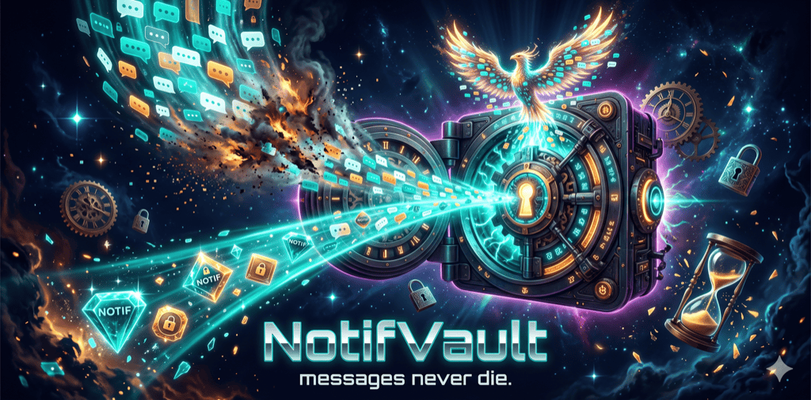

<p align="center">
  
</p>

# Kleene Petze

<!-- Project status -->
<p align="center">
  <a href="https://github.com/pepperonas/kleene-petze/releases/latest"></a>
  <a href="https://github.com/pepperonas/kleene-petze/releases/latest"></a>
  <a href="https://github.com/pepperonas/kleene-petze/releases"></a>
  <a href="https://github.com/pepperonas/kleene-petze/releases/latest"></a>
  <a href="https://github.com/pepperonas/kleene-petze/actions/workflows/release.yml"></a>
</p>
<p align="center">
  <a href="https://github.com/pepperonas/kleene-petze/commits/main"></a>
  <a href="https://github.com/pepperonas/kleene-petze/commits/main"></a>
  <a href="https://github.com/pepperonas/kleene-petze/issues"></a>
  
  
  
</p>

<!-- Tech stack -->
<p align="center">
  
  
  
  
  
  
</p>
<p align="center">
  
  
  
  
  
</p>

<!-- Data & privacy -->
<p align="center">
  
  
  
  
  
  
  
  
</p>

Speichert eingehende Nachrichten-Benachrichtigungen **dauerhaft und verschlüsselt** – wie
der Samsung-Benachrichtigungsverlauf, aber ohne 24-Stunden-Verfall. Gelöschte WhatsApp-
Nachrichten bleiben so lesbar, weil die ursprüngliche Benachrichtigung in eine lokale,
verschlüsselte Datenbank geschrieben wird, sobald sie ankommt.

## Download

Die fertige, signierte APK gibt es unter **[Releases](https://github.com/pepperonas/kleene-petze/releases/latest)**.
APK herunterladen → auf dem Gerät öffnen → Installation aus unbekannter Quelle erlauben.

## Wie es funktioniert

Android liefert jede Benachrichtigung an einen `NotificationListenerService`
(`service/NotificationCaptureService.kt`). WhatsApp sendet beim Löschen einer Nachricht
**keine** zweite Benachrichtigung – die Originalnachricht ist also längst angekommen.
Kleene Petze parst sie sofort (bevorzugt über `MessagingStyle`, das Absender + echten
Zeitstempel jeder Einzelnachricht enthält) und speichert sie ab. Mehrfach gelieferte
Nachrichten werden über einen Inhalts-Hash dedupliziert.

**Korrekte Chat-Zuordnung:** Nachrichten werden über einen *stabilen* Chat-Schlüssel
(`conversationKey` aus `shortcutId` → `tag` → Titel) gruppiert, nicht über den
Anzeigenamen. Der ist bei 1:1-Chats oft leer und bei Gruppen manchmal nicht gesetzt –
würde man danach gruppieren, zerfielen Gruppen pro Absender bzw. vermischten sich mit
gleichnamigen Einzelchats. So landet jeder Kontakt/jede Gruppe verlässlich in genau
einem Verlauf. Die Übersicht zeigt pro Chat den **neuesten Titel** + letzte Nachricht;
der Verlauf rendert als Chat-Ansicht mit Datumstrennern, Sprecher-Gruppierung und
farbigen Absendern.

## Was geht – und was nicht

| Funktion | Status |
|---|---|
| Text-Nachrichten (1:1 & Gruppen) | ✅ zuverlässig |
| Absender + echter Zeitstempel | ✅ via MessagingStyle |
| Korrekte Chat-Gruppierung (stabiler `conversationKey`) | ✅ |
| Chat-Ansicht: Datumstrenner, Sprecher-Gruppierung, Avatare | ✅ |
| Volltextsuche (mit Treffer-Hervorhebung), Export (CSV/JSON) | ✅ |
| Verschlüsselung (SQLCipher/AES-256), Biometrie-Sperre (re-lockt im Hintergrund) | ✅ |
| **Medien** (Fotos, Sprach-/Videonachrichten) | ❌ technisch nicht möglich – stecken nicht in der Notification, Scoped Storage sperrt WhatsApps Medienordner |
| Stummgeschaltete Chats | ❌ erzeugen oft keine Benachrichtigung |
| Nachrichten empfangen, während der Chat offen ist | ❌ keine Benachrichtigung |

## Bauen

1. **Android Studio** (Ladybug/2024.2+) → *Open* → diesen Ordner wählen. Gradle-Sync
   lädt alle Abhängigkeiten (AGP 8.7, Kotlin 2.0, Compose, Room, SQLCipher).
2. Gerät/Emulator anschließen → *Run ▶*.

Oder per Terminal: `./gradlew assembleDebug` → APK unter `app/build/outputs/apk/debug/`.
(Eine `local.properties` mit `sdk.dir=...` wird von Android Studio automatisch angelegt.)

### Tests

Reine JVM-Unit-Tests (kein Emulator nötig):

```bash
./gradlew testDebugUnitTest
```

Abgedeckt: Dedup-Schlüssel (`messageContentId`, mit fixem SHA-256-Anker), CSV-/JSON-Export-Escaping
(`ExportUtils`), Datums-/Zeit- und Identitäts-Helfer (`Format`) sowie das LIKE-Escaping der Suche
(`SearchUtils`).

## Einrichtung auf dem Samsung S24 Ultra (wichtig)

One UI killt Hintergrunddienste sehr aggressiv. Damit kein Mitschnitt verloren geht:

1. **Benachrichtigungszugriff erteilen** – beim ersten Start, oder
   *Einstellungen → Apps → Spezieller Zugriff → Benachrichtigungszugriff → Kleene Petze*.
2. **Akku-Optimierung ausnehmen** – im Onboarding-Schritt, oder
   *Einstellungen → Akku → Hintergrundnutzungslimits → „Nie in den Standby" → Kleene Petze hinzufügen*.
3. Optional: in *Einstellungen → Apps → Kleene Petze* die Option „Im Hintergrund aktiv lassen".

## Datenschutz / DSGVO

- Keine Netzwerkberechtigung, keine Cloud, kein Tracking. Alles bleibt auf dem Gerät.
- Datenbank verschlüsselt (SQLCipher, 256-bit). Schlüssel in `EncryptedSharedPreferences`
  (AES-256-GCM, Android Keystore). Backups (Cloud/Geräte­transfer) sind deaktiviert.
- Erfasst werden nur Benachrichtigungen, die **auf diesem Gerät** eingehen – also
  Nachrichten *an dich*. Beachte: gespeicherte Inhalte stammen von Dritten; deren
  Weiterverarbeitung/Weitergabe liegt in deiner Verantwortung als Betreiber.

## Projektstruktur

```
data/    CapturedMessage (Entity, mit conversationKey), MessageDao, AppDatabase,
         DatabaseProvider (SQLCipher), SettingsStore (DataStore)
notif/   MessageExtractor – Notification → CapturedMessage(s)
         MessageId – stabiler Dedup-Inhalts-Hash (messageContentId)
service/ NotificationCaptureService – der Listener
ui/      Compose-Screens (Onboarding, Home, Conversation, Settings) + ViewModel,
         Components (Avatar), Format (Datum/Zeit, Farben, Initialen)
util/    PermissionUtils, ExportUtils, SearchUtils (LIKE-Escaping)
src/test JUnit-Unit-Tests (MessageId, ExportUtils, Format, SearchUtils)
```

## Release erstellen (Maintainer)

Releases werden signiert und automatisch von GitHub Actions gebaut
(`.github/workflows/release.yml`). Der Signing-Keystore liegt **nur** im privaten Repo
`pepperonas/keystore` und in den Repo-Secrets (`KEYSTORE_BASE64`, `KEYSTORE_PASSWORD`,
`KEY_ALIAS`, `KEY_PASSWORD`) – nie in diesem Repo.

```bash
# versionCode (+1) und versionName in app/build.gradle.kts erhöhen, dann:
git tag v1.2.3 && git push origin v1.2.3
```

Der Workflow baut die signierte APK und hängt sie an einen neuen GitHub Release. Alle
Releases sind mit demselben Keystore signiert und damit als Update übereinander
installierbar.

---
© 2026 Martin Pfeffer | celox.io
